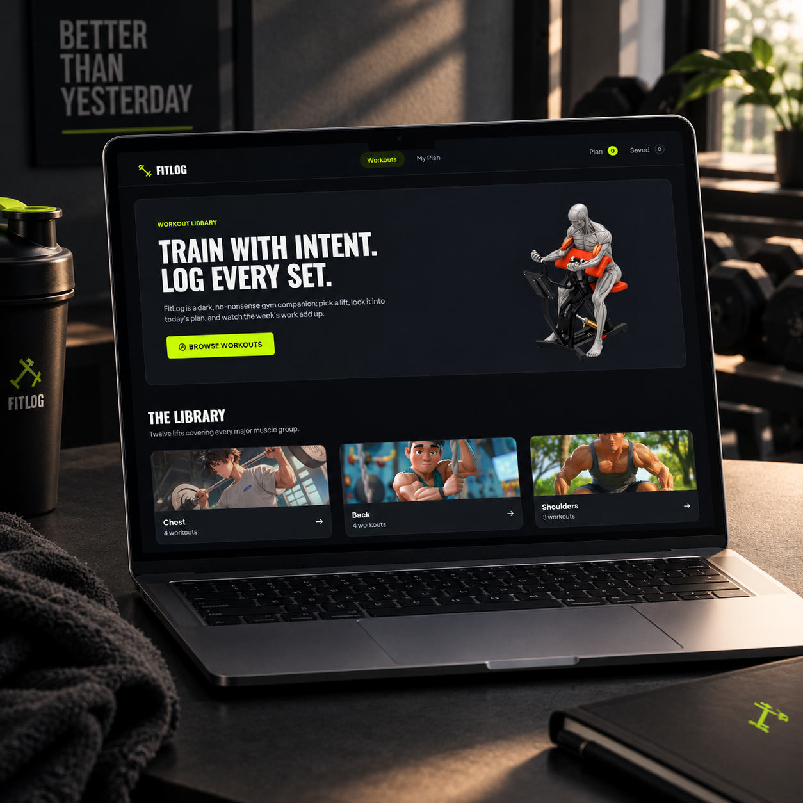
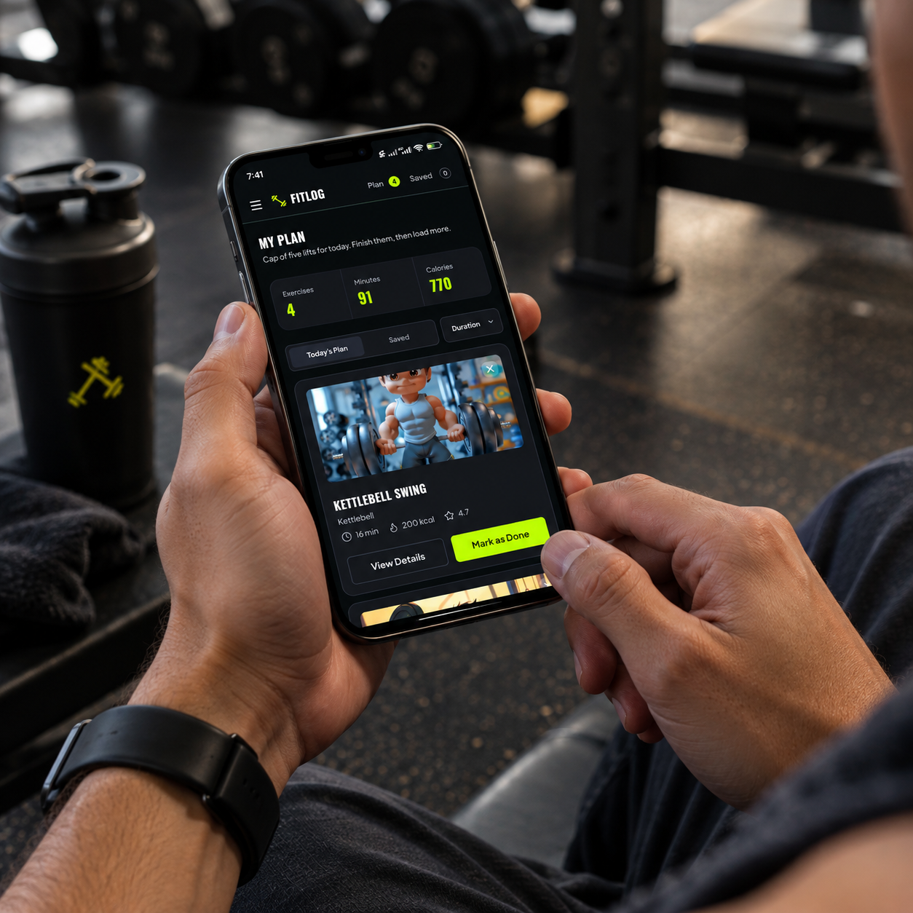

# FITLOG

### A modern workout discovery & planning app.

Explore workouts, save your favorites, and build your personalized daily workout plan through a clean, responsive interface.

**[Live Link](https://fitlog-myshphew.vercel.app)**

## Tech Stack

  

| Technology | Purpose |
|---|---|
| **Next.js** | Application framework, routing, and dynamic pages |
| **TypeScript** | Type-safe development and reusable interfaces |
| **React** | Component-based UI development |
| **Tailwind CSS** | Responsive styling and UI design |
| **React Context API** | Global state management for workouts, saved items, and daily plans |
| **REST API** | Fetching workout data and exercise details |
| **React Toastify** | Toast notifications for user actions |
| **Lucide React** | Lightweight icons throughout the interface |
| **Vercel** | Deployment and hosting |
| **npm** | Package and dependency management |

## Features

- **Workout Discovery** — Browse workouts with muscle groups, equipment, difficulty, duration, calories, and ratings.
- **Workout Details** — View detailed instructions, sets, reps, and exercise information.
- **Save Workouts** — Bookmark workouts for quick access later.
- **Today's Plan** — Build and manage a personalized daily workout routine.
- **Smart Sorting** — Organize workouts by duration, calories burned, or rating.

## Highlights

- Responsive & mobile-friendly
- Reusable component architecture
- React Context state management
- Dynamic workout routes
- Loading & empty states
- Toast notifications
- Clean dark UI

## Preview

  
  

### Built with curiosity & caffeine.

**Mushfique Hussain** · UI/UX Designer & Full-Stack Developer
